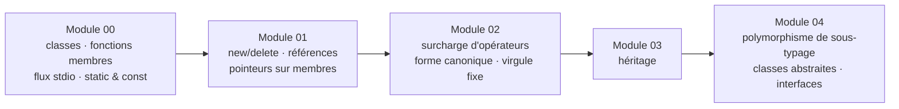

# Modules C++ 00 – 04

 

Fondamentaux de la programmation orientée objet, compilés avec `-Wall -Wextra -Werror -std=c++98`. Chaque module couvre un concept à travers de petits exercices thématiques.



## Module 00 — Classes & encapsulation
| Exercice | Contenu |
|---|---|
| `ex00` Megaphone | gestion d'argv, `toupper` sur `std::string`, `iostream` |
| `ex01` PhoneBook | classes `PhoneBook` / `Contact`, tableau d'objets de taille fixe, getters/setters, affichage formaté |
| `ex02` Account | reconstruire un `Account.cpp` manquant à partir de son header et des logs de test — membres statiques, ordre constructeurs/destructeurs |

## Module 01 — Mémoire & références
| Exercice | Contenu |
|---|---|
| `ex00` Zombie | instanciation pile vs tas — quand `new/delete` est réellement nécessaire |

## Module 02 — Surcharge d'opérateurs & forme canonique
| Exercice | Contenu |
|---|---|
| `ex00` Fixed | classe de nombres à virgule fixe en forme canonique orthodoxe : constructeurs par défaut/copie, `operator=`, destructeur |
| `ex01` Fixed | constructeurs `int` et `float`, `toInt()` / `toFloat()`, `operator<<` sur `std::ostream` |
| `ex02` Fixed | jeu d'opérateurs complet : comparaisons (`> < >= <= == !=`), arithmétique (`+ - * /`), `++`/`--` pré/post, `min`/`max` statiques |

Les nombres à virgule fixe stockent la valeur en entier avec 8 bits fractionnaires : `float ↔ raw = valeur × 2⁸` — de la précision arithmétique sans dérive du flottant.

## Module 03 — Héritage
| Exercice | Contenu |
|---|---|
| `ex00` ClapTrap | classe de base — attaque, dégâts, points d'énergie |
| `ex01` ScavTrap | hérite de ClapTrap — chaînage des constructeurs/destructeurs |
| `ex02` FragTrap | second enfant, même base, comportement différent |

## Module 04 — Polymorphisme
| Exercice | Contenu |
|---|---|
| `ex00` Animal → Dog/Cat | `makeSound()` virtuel, plus `WrongAnimal` qui montre le dispatch sans virtual |
| `ex01` Brain | copies profondes — destructeurs virtuels, aucun pointeur partagé entre copies |
| `ex02` | `Animal` devient abstraite — fonctions virtuelles pures |
| `ex03` Materia | `AMateria`, `ICharacter`, `IMateriaSource` — interfaces et inventaires en copie profonde |

## Compilation & lancement

Chaque exercice a son propre Makefile :

```bash
cd cpp04/ex00 && make && ./animals
```
