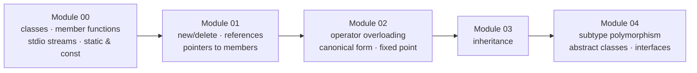

# C++ Modules 00 – 04

 

Object-oriented programming fundamentals, compiled with `-Wall -Wextra -Werror -std=c++98`. Each module covers one concept through small themed exercises.



## Module 00 — Classes & encapsulation
| Exercise | Content |
|---|---|
| `ex00` Megaphone | argv handling, `toupper` over `std::string`, `iostream` |
| `ex01` PhoneBook | `PhoneBook` / `Contact` classes, fixed-size array of objects, getters/setters, formatted output |
| `ex02` Account | rebuild a missing `Account.cpp` from its header and test logs — static members, constructor/destructor order |

## Module 01 — Memory & references
| Exercise | Content |
|---|---|
| `ex00` Zombie | stack vs heap instantiation — when `new/delete` is actually needed |

## Module 02 — Operator overloading & canonical form
| Exercise | Content |
|---|---|
| `ex00` Fixed | fixed-point number class in Orthodox Canonical Form: default/copy constructors, `operator=`, destructor |
| `ex01` Fixed | `int` and `float` constructors, `toInt()` / `toFloat()`, `operator<<` on `std::ostream` |
| `ex02` Fixed | full operator set: comparisons (`> < >= <= == !=`), arithmetic (`+ - * /`), pre/post `++`/`--`, static `min`/`max` |

Fixed-point numbers store a value as an integer with 8 fractional bits: `float ↔ raw = value × 2⁸` — arithmetic precision without floating-point drift.

## Module 03 — Inheritance
| Exercise | Content |
|---|---|
| `ex00` ClapTrap | base class — attack, damage, energy points |
| `ex01` ScavTrap | inherits ClapTrap — constructor/destructor chaining |
| `ex02` FragTrap | second child, same base, different behaviour |

## Module 04 — Polymorphism
| Exercise | Content |
|---|---|
| `ex00` Animal → Dog/Cat | `virtual makeSound()`, plus `WrongAnimal` showing dispatch without virtual |
| `ex01` Brain | deep copies — virtual destructors, no shared pointers between copies |
| `ex02` | `Animal` becomes abstract — pure virtual functions |
| `ex03` Materia | `AMateria`, `ICharacter`, `IMateriaSource` — interfaces and deep-copied inventories |

## Build & run

Each exercise has its own Makefile:

```bash
cd cpp04/ex00 && make && ./animals
```
